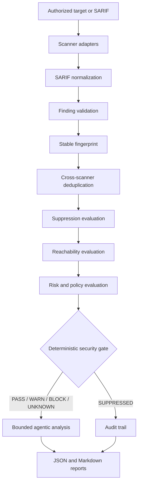

# Agentic VAPT

Agentic VAPT is a defensive, local-first pipeline for turning security scanner output into normalized,
deduplicated, explainable security decisions and auditable reports. It preserves the repository's original
day-by-day learning exercises while providing a cohesive application in `agentic_vapt/`.

The project is intended only for authorized security assessment. The built-in demo reads a local SARIF fixture
and does not contact or attack any target.

## Architecture



The security gate is the control boundary. AI analysis runs afterward as decision support and cannot change a
gate decision.

## What is implemented

- A scanner protocol plus local SARIF and Semgrep adapters.
- Fault-tolerant SARIF 2.x normalization with tool, rule, severity, location, URI, evidence, original result,
  and scanner fingerprint preservation.
- One normalized finding model with validation, identity, suppression, reachability, risk, decision, and raw
  metadata fields.
- Deterministic SHA-256 correlation fingerprints and metadata-preserving cross-scanner deduplication.
- External JSON suppression rules with selectors, reasons, expiry, and audit state.
- Conservative `REACHABLE`, `UNREACHABLE`, and `UNKNOWN` reachability states.
- Centralized `PASS`, `WARN`, `BLOCK`, `SUPPRESSED`, and `UNKNOWN` gate decisions with reasons.
- Offline heuristic analysis and an optional OpenAI Responses-compatible provider with bounded context,
  response validation, timeouts, and graceful errors.
- Auditable JSON and Markdown reports that retain suppressed, unreachable, blocked, and unknown findings.
- A safe fixture-based demo, 50 integrated tests, the 17 preserved Day-06 tests, and GitHub Actions CI.

## Repository layout

- `agentic_vapt/`: integrated application and CLI.
- `tests/`: discoverable unit and integration tests.
- `examples/`: safe SARIF demo and configuration.
- `docs/audit.md`: baseline audit, architecture rationale, and security review.
- `Day-01/` through `Day-12/`: preserved learning prototypes and notes.

## Learning history

The Day-01–Day-12 directories remain the project's learning record: Git and change intelligence, AST and
Tree-sitter exploration, differential analysis, Semgrep and SARIF, finding identity and gating, context and
risk scoring, source-aware prompting, structured AI analysis, and decision validation. The integrated package
turns those prototypes into the runnable pipeline documented below without erasing their educational context.

## Installation

Python 3.11 or newer is required. The runtime has no third-party Python dependencies.

Windows PowerShell:

```powershell
python -m venv .venv
.\.venv\Scripts\python.exe -m pip install -e ".[dev]"
```

Linux or macOS:

```bash
python3 -m venv .venv
./.venv/bin/python -m pip install -e '.[dev]'
```

Semgrep is optional and is needed only when invoking `--target` and `--rules`. Existing SARIF can always be
processed without installing a scanner.

## Safe local demo

```powershell
.\.venv\Scripts\python.exe -m agentic_vapt `
  --sarif examples/demo.sarif `
  --config examples/demo_config.json `
  --output-dir reports/demo `
  --exit-zero
```

The demo exercises raw findings, normalization, fingerprinting, exact deduplication, suppression, explicit
reachability, gating, offline analysis, and report generation. Reports are written to
`reports/demo/assessment.json` and `reports/demo/assessment.md`. `--exit-zero` is used because the realistic
fixture intentionally produces a `BLOCK` decision.

Without `--exit-zero`, CLI exit codes are:

- `0`: `PASS` or `WARN` and reports were written.
- `2`: security gate `BLOCK`.
- `3`: assessment `UNKNOWN`, including when no scanner produced valid SARIF.
- `64`: invalid command or configuration.
- `74`: report write failure.

## Scanners

Process one or more existing scanner outputs:

```powershell
.\.venv\Scripts\python.exe -m agentic_vapt --sarif path/to/first.sarif --sarif path/to/second.sarif
```

Run Semgrep against a local path under the current workspace:

```powershell
.\.venv\Scripts\python.exe -m agentic_vapt `
  --target src `
  --rules security/semgrep.yml `
  --config agentic-vapt.json
```

The Semgrep adapter uses a fixed argument list, never invokes a shell, enforces a timeout, confines target and
rule paths to the workspace, and treats missing executables, invalid output, and timeouts as structured scanner
states. A failed scanner cannot accidentally produce a passing assessment when no other scanner succeeds.

New scanners should implement the `Scanner` protocol and return a `ScanResult` containing SARIF. This keeps
scanner-specific behavior out of normalization and every downstream stage.

## SARIF normalization

The normalizer accepts SARIF 2.x documents and handles runs independently. It extracts:

- tool name, version, and information URI;
- rule ID, descriptions, help, properties, and rule-level severity;
- result message, level, confidence, endpoints, and vulnerability/CWE identity;
- all physical/logical locations, file URI, lines, columns, and snippets;
- original rule/result objects and scanner-provided fingerprints.

Missing optional fields produce safe defaults. A malformed result is recorded and skipped without discarding
valid sibling results. A malformed root or unsupported version fails closed as invalid scanner output.

## Fingerprinting and deduplication

The correlation fingerprint is SHA-256 over a canonical JSON object containing:

1. canonical vulnerability type, or the rule ID when no type is supplied;
2. normalized resource path;
3. primary start line;
4. normalized endpoint.

Scanner name, timestamps, prose messages, and volatile evidence are excluded. Paths normalize URI encoding,
slashes, drive prefixes, and case. Cross-scanner findings correlate only when they provide the same canonical
vulnerability type and location; otherwise rule IDs remain part of identity. This avoids merging unrelated
findings merely because their messages look alike.

When duplicates merge, the pipeline keeps the strongest severity and confidence, combines sources, evidence,
and locations deterministically, and retains each correlated raw finding under `raw_metadata`.

## Suppression

Suppressions live in the configuration file and never delete findings. Each rule requires an ID, reason, and
one or more selectors. Supported selectors are `fingerprint`, `rule_id`, `vulnerability_type`, `resource`,
`endpoint`, and `scanner`; glob patterns are accepted. Optional `expires_at` uses ISO 8601.

```json
{
  "suppressions": [
    {
      "id": "accepted-test-fixture",
      "reason": "Non-production fixture reviewed by the security team.",
      "selectors": {
        "rule_id": "demo.*",
        "resource": "fixtures/*"
      },
      "expires_at": "2030-01-01T00:00:00Z"
    }
  ]
}
```

Matched findings receive `SUPPRESSED` plus the rule ID and reason in both reports. Invalid suppression rules are
reported and do not suppress anything.

## Reachability and risk

`UNREACHABLE` requires explicit scanner evidence such as `properties.reachable=false` or
`properties.reachability="unreachable"`. Positive context linking user input to a database, command, or
external endpoint may establish `REACHABLE`. Missing or inconclusive evidence is always `UNKNOWN`, never
optimistically unreachable.

Risk scores are deterministic and derived from severity, confidence, and reachability. They aid ordering and
reporting; the gate decision remains policy-based and explainable.

## Security gate

The default policy blocks reachable high/critical findings, warns on medium findings and high/critical findings
with unknown reachability, passes explicitly unreachable or lower-risk valid findings, preserves suppressions,
and returns unknown for invalid findings or unknown severity. Set `block_unknown_reachability` to fail closed on
high/critical findings without reachability evidence.

```json
{
  "gate": {
    "block_severities": ["critical", "high"],
    "warn_severities": ["medium"],
    "block_unknown_reachability": false,
    "analyze_decisions": ["block", "warn", "unknown"]
  }
}
```

## Agentic analysis

The default `heuristic` provider is deterministic, offline, and needs no credentials. Set the provider to
`none` to disable analysis or `openai` to use an OpenAI Responses-compatible HTTPS endpoint.

Environment variables:

- `AGENTIC_VAPT_AI_PROVIDER`: `heuristic`, `none`, or `openai`.
- `AGENTIC_VAPT_LLM_API_KEY`: required only for `openai`.
- `AGENTIC_VAPT_LLM_MODEL`: model name; defaults to `gpt-5-mini`.
- `AGENTIC_VAPT_LLM_BASE_URL`: defaults to `https://api.openai.com/v1/responses`.
- `AGENTIC_VAPT_LLM_ALLOWED_HOSTS`: comma-separated HTTPS host allow-list; defaults to `api.openai.com`.

Remote endpoints require HTTPS and an exact host allow-list match. HTTP is accepted only for localhost to
support local model servers, and redirects are not followed. Credentials are never written to findings or
reports. Prompts mark scanner evidence and source snippets as untrusted data, context is bounded, structured
output is validated, and provider failures become per-finding analysis errors. AI output cannot bypass or
modify deterministic gate decisions.

## Reporting

`assessment.json` is machine-readable and contains scanner states, stage counts, pipeline errors, every finding,
raw metadata, decisions, and AI analysis. `assessment.md` is the human-readable audit report. Suppressed,
unreachable, passed, warned, blocked, and unknown findings remain visible.

## Testing and validation

Run the integrated suite:

```powershell
.\.venv\Scripts\python.exe -m unittest discover -s tests -v
```

Run the preserved adapter suite:

```powershell
.\.venv\Scripts\python.exe Day-06/test_semgrep_adapter.py
```

Run compilation and lint checks:

```powershell
.\.venv\Scripts\python.exe -m compileall -q agentic_vapt tests
.\.venv\Scripts\ruff.exe check agentic_vapt tests
```

Tests use in-memory/local fixtures only. They do not scan or attack external systems. Coverage includes valid,
empty, optional, and malformed SARIF; fingerprints; exact and cross-scanner duplicates; suppressions;
reachability; every gate state; valid/invalid/missing/failing AI behavior; scanner failure; reporting; and the
complete mocked assessment.

## Configuration and failure behavior

See `examples/demo_config.json` for every configuration section. Timeouts and maximum SARIF size are positive,
validated values. Scanner, normalization, suppression, AI, and file errors are preserved in the result. A
single malformed result does not terminate the assessment. If no scanner yields valid SARIF, the assessment is
`UNKNOWN`, not `PASS`.

Copy `.env.example` for local environment values. Never commit `.env` or real secrets.

## Limitations

- Built-in execution currently supports Semgrep; other tools integrate by supplying SARIF or a small adapter.
- Reachability consumes explicit scanner/context evidence and does not yet build a whole-program call graph or
  code property graph.
- Cross-scanner deduplication is conservative and benefits from scanners emitting CWE or another canonical
  vulnerability type.
- The external AI provider is optional decision support, not exploit validation or an autonomous authority.
- This project does not perform DAST, exploitation, or network target discovery.

## Security considerations

Use the project only on repositories and systems you are authorized to assess. Review scanner rules before
running them. Keep targets/rules inside the workspace, protect reports because raw evidence may contain source
snippets, and rotate any real credential that appears in a finding. The demo uses reserved `.invalid` URLs and
never requests them.
